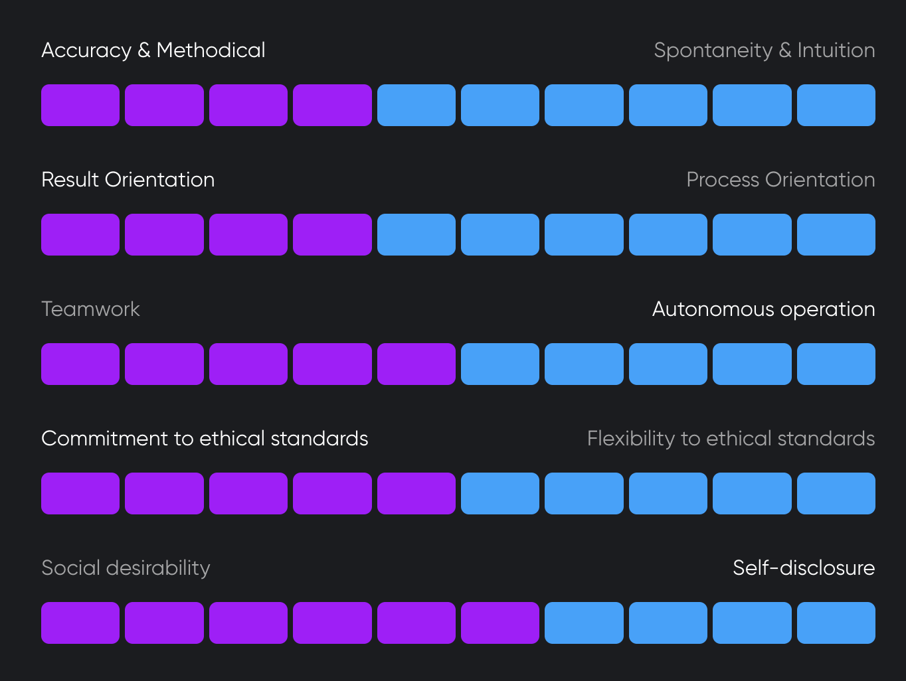

# Hi 👋, I'm Andrii Lundiak 

## a persistent and determined Fullstack Developer

- 👯 I’m looking for the Senior job position as Fullstack or Frontend engineer/developer with _full-time regular employment_ within Poland.

- ✨ My main tech stack is: 

    [?style=for-the-badge&logo=angular&labelColor=black)](#) 

- 🌱 I’m currently learning **NestJS, CosmosDB, Redis**
- ✨ I also like to contribute to open source projects, buu not much for active maintenance.
- 📝 I sometimes write articles on [https://worknme.wordpress.com/](https://worknme.wordpress.com/)

## Other Languages, Tools, Libraries, Frameworks

These are languages and tools which I have worked with, either commercially for cleint's projects or tried by myself in educational mode. 

<!-- 
https://shields.io/docs/logos#logocolor-parameter

 
-->

                                                     

## My GitHub account [@alundiak](https://github.com/alundiak) statistics

 

<!-- NOT stable Heroku app -->
<!-- 

 -->

## Trophies, achievemets

  

## [Job Cannon](https://jobcannon.io)

I don't know how good assesment results are, but I know for sure, that I can adapt to any team when we all work together on good software to get our Client happy and rich :) 

## Contacts

## Credits

This page has been generated with a bit of help and hints from:

- [gh-profile-readme-generator](https://rahuldkjain.github.io/gh-profile-readme-generator/)
- [github-readme-stats](https://github.com/anuraghazra/github-readme-stats)
- [awesome-github-profile-readme](https://github.com/abhisheknaiidu/awesome-github-profile-readme)
- [github-readme-streak-stats](https://github.com/DenverCoder1/github-readme-streak-stats)
- [MaksymRudnyi](https://github.com/MaksymRudnyi)
- [Sheilds and Badges](https://shields.io/badges)
- [GitHub Pages](https://docs.github.com/en/pages/quickstart)
